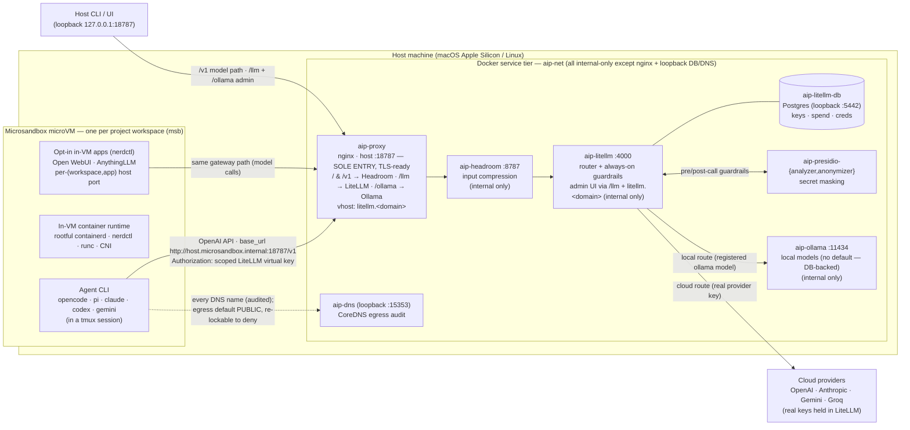

# AI Development Platform — architecture

Top-level containers and the model data path. The diagram below is
[Mermaid](https://mermaid.live) — it renders to an image on GitHub and in most
Markdown viewers; an ASCII version follows for terminals.

> **Note:** `docs/architecture.png` (used by `docs/architecture-overview.md`) is a
> rendered export of `docs/architecture.mmd` and must be **regenerated from that
> Mermaid source** after any architecture change (e.g.
> `mmdc -i docs/architecture.mmd -o docs/architecture.png`).

## Containers + model data flow (Mermaid)



## Same thing in ASCII

```text
                     Host machine
 ┌───────────────────────────────────────────────────────────────────────────┐
 │  Microsandbox microVM (per workspace)                                       │
 │  ┌───────────────────────────────┐                                         │
 │  │ agent CLI (opencode/pi/…)      │   egress: DEFAULT PUBLIC (msb net-rules)│
 │  │ tmux session                   │ ······ DNS ······▶ aip-dns (audit)      │
 │  │ in-VM runtime: containerd+     │   DNS-audited; re-lockable to deny      │
 │  │ nerdctl; opt-in apps Open      │                                         │
 │  │ WebUI / AnythingLLM (nerdctl)  │                                         │
 │  └───────────────┬───────────────┘                                         │
 │                  │ OpenAI API, base_url = http://host.microsandbox.internal:18787/v1             │
 │                  │ Authorization: scoped LiteLLM virtual key (no real keys)│
 │  Docker service tier (aip-net) — every container internal-only but nginx     │
 │                  ▼                  (loopback exceptions: DB :5442, DNS :15353)│
 │            aip-proxy (nginx, host :18787 — SOLE host entry)                  │
 │              / & /v1 → Headroom · /llm → LiteLLM · /ollama → Ollama          │
 │              vhost: litellm.<domain>  (the only host UI — LiteLLM admin)     │
 │                  ▼                    ▲                                      │
 │            aip-headroom :8787         └── host CLI / UI (loopback :18787)    │
 │              (input compression, internal-only)                              │
 │                  ▼                                                          │
 │            aip-litellm  :4000   ── guardrails ──▶ aip-presidio (secrets)    │
 │              router (admin UI via /llm + litellm.<domain>, internal-only)    │
 │                  │  └── aip-litellm-db (Postgres) (+ tool-firewall)          │
 │          ┌───────┴────────┐                                                 │
 │          ▼                ▼                                                 │
 │     aip-ollama       Cloud providers (OpenAI/Anthropic/Gemini/Groq)         │
 │     :11434           real provider keys live IN LiteLLM, never in the VM    │
 │     local models                                                            │
 └───────────────────────────────────────────────────────────────────────────┘
```

## The path, in words

1. The **agent CLI** runs inside a hardware-isolated **Microsandbox microVM**. Its
   provider config points `base_url` at the host gateway (`http://host.microsandbox.internal:18787/v1`)
   and authenticates with a **scoped LiteLLM virtual key** — the real provider
   keys are never on the workspace.
2. Workspace **egress defaults to "public"** (Microsandbox net-rules applied at
   create — the open internet is reachable so in-VM `nerdctl` can pull images and AI
   processes reach the net, while private ranges stay blocked). Every DNS name is
   logged by **aip-dns** (`ai network log`), and a project is re-lockable to
   default-deny with `ai network egress deny` (only the model gateway +
   allow-listed host services then reachable).
3. The request hits **aip-proxy** (nginx, host `:18787` — the TLS-termination point
   and the **sole** host entry; every other service container is internal-only on
   `aip-net`, the only loopback exceptions being Postgres `:5442` and `aip-dns`
   `:15353`). The default `/` and `/v1` routes forward to **aip-headroom** (input
   compression), then to **aip-litellm**; `/llm` and `/ollama` (and the
   `litellm.<domain>` vhost) front the LiteLLM admin + Ollama HTTP surfaces
   directly. The host CLI reaches the gateway on loopback `127.0.0.1:18787`.
4. **aip-litellm** is the router. Always-on **guardrails** run on every request and
   every route (cloud included, since all traffic traverses the proxy): **Presidio**
   secret masking (financial/identity secrets only, not general PII) + `hide-secrets`,
   and a **tool-firewall** (`tool_permission`) that denies destructive command
   tool-calls. (The in-process prompt-injection detector and the unmaintained LLM
   Guard were both removed — they false-positived on ordinary coding/Ollama traffic.)
   Its admin UI / virtual keys / spend live in **aip-litellm-db**.
5. LiteLLM routes to **aip-ollama** (a registered local Ollama model) or to a
   **cloud provider** using the real key it holds. The model set is DB-backed and
   catalog-driven with **no built-in default model**. The response streams back along
   the same path (SSE-friendly through nginx) to the agent.

Each workspace microVM ships a **rootful in-VM container runtime** (containerd +
nerdctl + runc + CNI), on which the platform runs **opt-in AI apps** (`internal/apps`)
as `nerdctl` containers *inside* the VM — **Open WebUI** and **AnythingLLM**,
selected with `ai create --apps` or managed with `ai apps`. Each app gets the
workspace project dir (`~/project`) mounted at `/workspace` in its container,
published on a unique per-`(workspace, app)` host port, and points at
the *same* gateway path (`http://host.microsandbox.internal:18787/v1` with the
workspace's scoped virtual key) — never LiteLLM directly. There are no optional
**host** services: the former host Open WebUI is now this in-VM app, and Odysseus
was removed entirely.

Every OS base image also bakes in a common dev-tooling layer: Git, the GitHub CLI,
the latest **Python 3** (system-wide, backing the per-project `~/project/.venv-msb`
virtualenv created at start), **uv** (Astral's Python package/tool manager, installed
for the workspace user onto `~/.local/bin`), and **Graphify** (the knowledge-graph
skill for AI coding assistants — PyPI `graphifyy`, CLI `graphify`), installed via
`uv tool install "graphifyy[…extras]"` with all optional extras except the
region/DB-specific `chinese,azure,bedrock,falkordb,neo4j,leiden,dm`. Each selected
agent CLI registers Graphify with itself **at workspace start**, once per project
(`graphify install` for claude-code, `graphify install --platform <cli>` for
codex/gemini/opencode/pi) — not in the Dockerfile, since `--project` writes into the
bind-mounted project dir. Graphify's headless LLM backend is an Ollama model chosen
at `ai create` (`--graphify-model`), routed through the gateway as `ollama/<model>`.
Node.js is likewise baked into every base, so neither Python nor Node is a
`--stacks` option; the selectable software stacks are
`go`, `rust`, `java`, `maven`, `deno`. See `spec/01-architecture-spec.md`
for the full design and `AGENTS.md` for the container/wiring summary.
