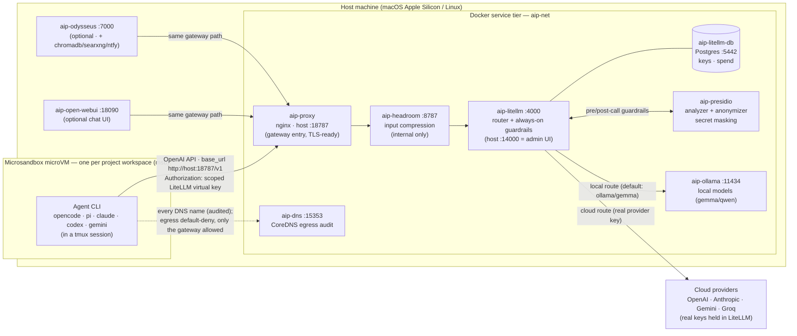

# AI Development Platform — architecture

Top-level containers and the model data path. The diagram below is
[Mermaid](https://mermaid.live) — it renders to an image on GitHub and in most
Markdown viewers; an ASCII version follows for terminals.

## Containers + model data flow (Mermaid)



## Same thing in ASCII

```text
                     Host machine
 ┌───────────────────────────────────────────────────────────────────────────┐
 │  Microsandbox microVM (per workspace)                                       │
 │  ┌───────────────────────────────┐                                         │
 │  │ agent CLI (opencode/pi/…)      │   egress: DEFAULT-DENY (msb net-rules)  │
 │  │ tmux session                   │ ······ DNS ······▶ aip-dns (audit)      │
 │  └───────────────┬───────────────┘   only the gateway host:port is allowed │
 │                  │ OpenAI API, base_url = http://host:18787/v1             │
 │                  │ Authorization: scoped LiteLLM virtual key (no real keys)│
 │  Docker service tier (aip-net)                                              │
 │                  ▼                                                          │
 │            aip-proxy (nginx :18787)   ◀── aip-open-webui :18090 (optional)  │
 │                  │                    ◀── aip-odysseus  :7000  (optional)   │
 │                  ▼                                                          │
 │            aip-headroom :8787   (input compression, internal-only)          │
 │                  ▼                                                          │
 │            aip-litellm  :4000   ── guardrails ──▶ aip-presidio (secrets)    │
 │              router + admin UI (:14000)           (+ tool-firewall,         │
 │                  │  └── aip-litellm-db (Postgres)   prompt-injection)       │
 │          ┌───────┴────────┐                                                 │
 │          ▼                ▼                                                 │
 │     aip-ollama       Cloud providers (OpenAI/Anthropic/Gemini/Groq)         │
 │     :11434           real provider keys live IN LiteLLM, never in the VM    │
 │     local models                                                            │
 └───────────────────────────────────────────────────────────────────────────┘
```

## The path, in words

1. The **agent CLI** runs inside a hardware-isolated **Microsandbox microVM**. Its
   provider config points `base_url` at the host gateway (`http://host:18787/v1`)
   and authenticates with a **scoped LiteLLM virtual key** — the real provider
   keys are never on the workspace.
2. Workspace **egress is default-deny** (Microsandbox net-rules applied at create);
   only the model gateway is reachable, and every DNS name is logged by **aip-dns**
   (`ai network log`).
3. The request hits **aip-proxy** (nginx, host `:18787` — the TLS-termination point
   and the single entry), which forwards to **aip-headroom** (input compression),
   then to **aip-litellm**.
4. **aip-litellm** is the router. Always-on **guardrails** run on every request and
   every route (cloud included, since all traffic traverses the proxy): **Presidio**
   secret masking + `hide-secrets`, a **tool-firewall** (`tool_permission`) that
   denies destructive command tool-calls, and an in-process **prompt-injection**
   detector. Its admin UI / virtual keys / spend live in **aip-litellm-db**.
5. LiteLLM routes to **aip-ollama** (local models — the default `gemma`) or to a
   **cloud provider** using the real key it holds. The response streams back along
   the same path (SSE-friendly through nginx) to the agent.

Optional UIs (**aip-open-webui**, **aip-odysseus**) use the *same* gateway path —
never LiteLLM directly. See `spec/01-architecture-spec.md` for the full design and
`AGENTS.md` for the container/wiring summary.
