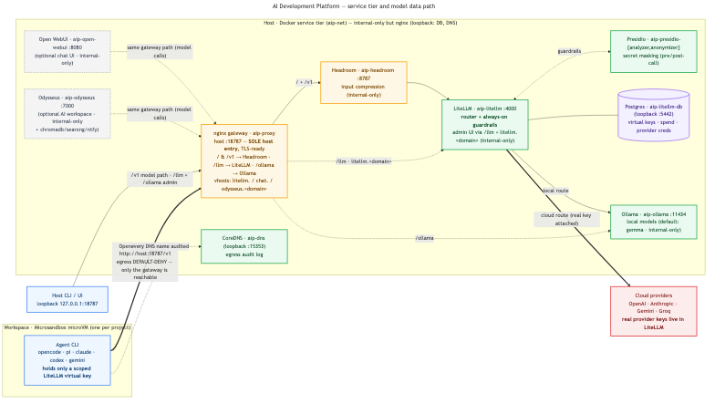

# AI Development Platform — architecture

This is the canonical architecture reference for the `ai` platform: the container
topology, the model data path, and per-workspace tooling. For the exact CLI surface
see `spec/04-cli-specification.md`; for the full end-state design see
`spec/01-architecture-spec.md`; for narrative implementation detail see `AGENTS.md`.

The **canonical diagram** is [`docs/architecture.mmd`](architecture.mmd) (Mermaid
source — includes every service: proxy, headroom, litellm + DB, presidio, valkey,
redisinsight, dns). Its rendered export is embedded below.

> **Note:** after any architecture change, edit `docs/architecture.mmd` and
> regenerate the PNG from it (`make diagram`, which runs `mmdc -i
> docs/architecture.mmd -o docs/architecture.png`). Do not hand-maintain a separate
> diagram elsewhere — the single source avoids drift.

## End-to-end flow

A coding agent runs inside a hardware-isolated **Microsandbox microVM** (one per
project workspace) and speaks the OpenAI API to a single host gateway at
`http://host.microsandbox.internal:18787/v1`, authenticating with a **scoped
LiteLLM virtual key** — real provider keys are never on the workspace. Workspace
egress defaults to **"public"** (the open internet is reachable — so in-VM
`nerdctl` can pull images and AI processes reach the net — while private ranges
stay blocked); every DNS name the VM resolves is logged for audit
(`ai network log`), and a project is re-lockable to default-deny with
`ai network egress deny`.

1. The request hits **aip-proxy** (nginx, host `:18787`) — the **sole** host entry
   point; every other service container is internal-only on `aip-net` (the only
   loopback exception is `aip-dns` at `:15353`; Postgres `aip-litellm-db` is also
   internal-only, no host port, reached at `aip-litellm-db:5432`). The default `/`
   and `/v1` routes forward **directly to aip-litellm**; `/llm` (and the
   `litellm.<domain>` + `valkey.<domain>` vhosts) fronts the LiteLLM admin +
   RedisInsight surfaces. nginx no longer routes to Headroom at all. The host CLI
   reaches the gateway on loopback `127.0.0.1:18787`.
2. **aip-litellm** is the router. **Guardrails are user-selectable** (chosen at
   `ai setup` via a picker / `--guardrails`, persisted in `runtime.yaml`); only the
   enabled ones are rendered into the LiteLLM config, and each rendered guardrail is
   `default_on: true` — since every route (cloud included) traverses the proxy, a
   client cannot opt out of an **enabled** guardrail. **Headroom input compression**
   (`headroom-compression`, `pre_call`) is the only guardrail on by default: LiteLLM
   calls it **in-process**, POSTing the request messages to
   `http://aip-headroom:8787/v1/compress` and swapping in the compressed result
   before dispatch. The security guardrails are **opt-in**: **Presidio** secret
   masking (financial/identity secrets only, not general PII — CREDIT_CARD, US_SSN,
   US_BANK_NUMBER, IBAN_CODE, CRYPTO), `hide-secrets` API-key/token detection, and a
   **tool-firewall** (`tool_permission`) that denies destructive command tool-calls.
   An unselected guardrail is omitted entirely — it never references a backend that
   isn't running (e.g. Presidio is only launched when secret-masking is selected).
   (The in-process prompt-injection detector and the unmaintained LLM Guard were
   both removed — they false-positived on ordinary coding traffic.) Its admin UI /
   virtual keys / spend live in **aip-litellm-db**.
3. LiteLLM routes to the **local-inference backend** — **omlx**
   ([jundot/omlx](https://github.com/jundot/omlx)), a host-side, macOS/Apple-
   Silicon-only backend reached through the `host.docker.internal` gateway: ONE
   shared `omlx serve --model-dir <dir> --port 8100` process (not a container),
   scanning its own model directory and serving every model it finds — or to a
   **cloud provider** using the real key it holds. Local models are registered
   DB-backed with the public handle `omlx/<id>` (used verbatim, routed
   `openai/<id>` against the one shared `api_base`). omlx is the **sole**
   local-inference runtime, with no fallback (there is no per-model engine
   choice, no per-model port, and no LRU eviction); model download/add/remove/
   tune all happen entirely inside **omlx's own admin panel**
   (`ai services console omlx`), never through this CLI — the platform only
   keeps LiteLLM's `omlx/*` registrations synced with omlx's live
   `GET /v1/models` (`ai models refresh`, or automatically at `ai setup`/
   `ai services start|restart omlx`). The model set is DB-backed and
   catalog-driven with **no built-in default model**. The response streams back
   along the same path (SSE-friendly through nginx) to the agent. Installing/
   starting omlx is a `hardware bring-up` seam (see
   `internal/setup/omlx_host.go`).

## The pieces

- **Workspace microVM / agent CLI** — hardware-isolated per-project sandbox
  (opencode · omp · claude-code · codex · gemini · hermes; opencode is
  the default). Holds only a scoped LiteLLM virtual key.
- **In-VM container runtime + apps** — every workspace microVM ships a rootful OCI
  runtime (containerd + nerdctl + runc + CNI), on which the platform runs opt-in AI
  apps as `nerdctl` containers *inside* the VM — currently **Open WebUI** (guest
  port 8080), selected with `ai create --apps` or managed with `ai apps`. Each app
  mounts the project dir at `/workspace`, is published on a unique
  per-`(workspace, app)` host port chosen at create (`--app-port <app>=<port>`,
  persisted in `config.yaml` `apps:`), and routes its model calls through the
  *same* gateway path as the agent — never LiteLLM directly. Agent-CLI web
  dashboards get the same treatment — currently only **hermes**
  (`hermes dashboard`, default port 9119, `--app-port hermes=<port>`, persisted in
  `config.yaml` `agent_dashboards:`).
- **nginx gateway (`aip-proxy`, host `:18787`)** — the sole host entry point and
  TLS-termination point; routes `/` and `/v1` to LiteLLM, `/llm` to the LiteLLM
  admin surface, and serves two Host-vhost subdomains — `litellm.<domain>` (the
  LiteLLM admin UI) and `valkey.<domain>` (the RedisInsight GUI). Launched with
  `--add-host=host.docker.internal:host-gateway` so it (and LiteLLM) can reach the
  host-side omlx inference backend.
- **Headroom (`aip-headroom`, internal-only)** — the input-compression service
  called in-process as LiteLLM's `pre_call` guardrail (mechanism above, flow
  step 2). Applies the per-project context knobs (`ai context strategy`). On by
  default; the reconcile brings it up before LiteLLM.
- **LiteLLM (`aip-litellm`, internal-only)** — the model router and the
  enforcement point for the user-selectable guardrails. Holds the real provider
  keys; its admin UI is reached only through nginx, never published directly.
- **Presidio (`aip-presidio-analyzer` + `aip-presidio-anonymizer`)** — backs
  LiteLLM's opt-in secret-masking guardrail; its containers are pulled and started
  **only when secret-masking is selected** (`ai services status` reports it
  "disabled" otherwise).
- **Postgres (`aip-litellm-db`, internal-only, no host port, reached at
  `aip-litellm-db:5432`)** — backs LiteLLM's admin UI, virtual keys, spend, and the
  encrypted provider-credential store (the one stateful service).
- **omlx (host-side, the sole local-inference backend, macOS/Apple Silicon
  only, no fallback)** — ONE shared `omlx serve --model-dir <dir> --port 8100`
  process (not an `aip-*` container), reached by containers at
  `http://host.docker.internal:8100/v1`. It scans its own model directory
  (`~/.ai-platform/volumes/models/omlx`) and serves every model it finds — there
  is no per-model port, no LRU eviction, and no per-model resource-cap. Model
  download/add/remove/tune all happen entirely inside **omlx's own admin panel**
  (`http://127.0.0.1:8100/admin`, reached with `ai services console omlx`) —
  never through this CLI. The platform auto-installs it into
  `~/.ai-platform/venv` when absent and keeps LiteLLM's `omlx/*` registrations
  synced with omlx's live model list (`ai models refresh`, or automatically at
  `ai setup`/`ai services start|restart omlx`).
- **Valkey + RedisInsight (`aip-valkey` / `aip-redisinsight`, internal-only)** — a
  single standalone Valkey instance backs LiteLLM's response cache; RedisInsight is
  its GUI, surfaced through nginx at the `valkey.<domain>` vhost. Both are
  always-on core services.
- **DNS audit (`aip-dns`, CoreDNS, loopback `:15353`)** — the egress-audit resolver
  microVMs forward DNS to, so attempted names are logged (`ai network log`) —
  audit, not enforcement.
- **Keys-in-LiteLLM** — real provider keys (OpenAI/Anthropic/Gemini/Groq/…) live
  only in LiteLLM's credential store; the agent authenticates to the gateway with a
  revocable, scoped virtual key.

There are no optional **host** services today: the former host Open WebUI is now
the in-VM app above, and Odysseus was removed from the platform entirely.

## Dev tooling and AI tools baked into every workspace

Every OS base image bakes in a common dev-tooling layer: Git, the GitHub CLI,
**Node.js** (pinned Node 24 LTS), the latest **Python 3** (system-wide, backing the
per-project `~/project/.venv-msb` virtualenv created at start), **uv** (Astral's
Python package/tool manager, installed for the workspace user onto `~/.local/bin`),
**rtk** (`rtk-ai/rtk`, a dev-command output compressor, via its `install.sh`), and
the **Headroom** CLI (`headroom-ai[proxy]`, for in-VM `headroom wrap <cli>`).
Because Node.js and Python 3 are baked in, neither is a `--stacks` option — the
selectable software stacks are `go`, `rust`, `java`, `maven`, `deno`.

The per-project **AI tools** are a separate, selectable set (one `--tools`
multi-select at `ai create`, or the wizard's AI-tools step): **caveman**,
**graphify**, **code-review-graph**, and **codebase-memory-mcp** (defaults: the
first three ON, codebase-memory-mcp OFF). Each maps to a `context.*_enabled` bool
in `config.yaml`.

- **graphify** (the knowledge-graph skill for AI coding assistants — PyPI
  `graphifyy`, CLI `graphify`) is not baked into every OS base: when selected it is
  installed for the workspace user by a conditional Dockerfile snippet
  (`internal/templates/files/tools/graphify/`) via
  `uv tool install "graphifyy[…extras]"` (all optional extras except the
  region/DB/niche-specific `chinese,azure,bedrock,falkordb,neo4j,leiden,dm,pascal`),
  and each selected agent CLI registers Graphify with itself **at workspace
  start**, once per project (`graphify install` for claude-code,
  `graphify install --platform <cli>` for codex/gemini/opencode — not in
  the Dockerfile, since `--project` writes into the bind-mounted project dir).
  Graphify's headless LLM backend is a model picked from omlx's live model list
  at `ai create` (`--graphify-model` / the wizard's picker) — no download
  happens at create time, since model management stays entirely in omlx's own
  admin panel — and it is routed through the gateway as `omlx/<name>`.
- **code-review-graph** (`code-review-graph.com`; per-CLI `install --platform`,
  then `build` + a D3 graph visualization) and **codebase-memory-mcp**
  (`DeusData/codebase-memory-mcp`; auto-detecting `install`, optional on-demand 3D
  graph UI on `:9749`) are likewise appended to the project Dockerfile as
  conditional snippets only when chosen (not baked into every base) and, when
  selected, registered as an MCP server with each installed agent CLI at
  workspace start (`workspace.registerCodeReviewGraph` /
  `registerCodebaseMemory`, once-guarded + best-effort). Both are local and
  keyless.
- **caveman** is installed at workspace start by its own upstream installer
  (`registerCaveman`).

See `spec/01-architecture-spec.md` for the full design and `AGENTS.md` for the
container/wiring summary.
