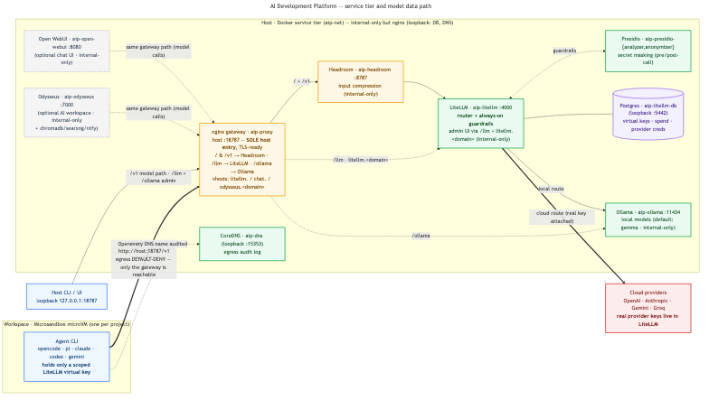

# AI Development Platform — architecture overview

## End-to-end flow

A coding agent runs inside a hardware-isolated **Microsandbox microVM** (one per project workspace) and speaks the OpenAI API to a single host gateway at `http://host.microsandbox.internal:18787/v1`. Workspace egress defaults to **"public"** — the open internet is reachable (so the in-VM container runtime can pull images and AI processes reach the net) while private ranges stay blocked, every DNS name the VM looks up is logged for audit, and a project is re-lockable to default-deny with `ai network egress deny`. The **nginx gateway** (`aip-proxy`) is the sole host entry: every other service container is internal-only on the `aip-net` Docker network. The request enters nginx and is passed **directly to LiteLLM**, which (with the user-selected guardrails enabled) may compress it in-process via the **Headroom** guardrail before routing the call to a **local Ollama** model or a **cloud provider**. Crucially, the agent holds only a scoped LiteLLM **virtual key**; the real provider API keys live inside LiteLLM, never in the workspace, and the streamed response returns along the same path. The host CLI reaches the gateway on loopback `127.0.0.1:18787`.

## The pieces

- **Workspace microVM / agent CLI** — hardware-isolated per-project sandbox (opencode · pi · omp · claude · codex · gemini · copilot · openclaw · hermes); holds only a scoped LiteLLM virtual key, with egress defaulting to "public" (DNS-audited, re-lockable to deny). Every OS base bakes in Git, the GitHub CLI, **Node.js**, the latest **Python 3**, **uv** (Astral's package/tool manager), **Graphify** (PyPI `graphifyy`, CLI `graphify`, installed via `uv tool install` with all extras except the region/DB-specific ones), **rtk** (`rtk-ai/rtk`, a dev-command output compressor, installed via its `install.sh`), and the **Headroom** CLI (`headroom-ai[proxy]`, for in-VM `headroom wrap <cli>`); each selected agent CLI registers Graphify with itself at workspace start, once per project (`graphify install [--platform <cli>]`), and Graphify's LLM backend is an Ollama model chosen at `ai create` (`--graphify-model`) routed through the gateway. Node.js is likewise baked in, so neither Python nor Node is a `--stacks` option — the selectable stacks are `go · rust · java · maven · deno`.
- **In-VM container runtime + apps** — every workspace microVM ships a rootful OCI runtime (containerd + nerdctl + runc + CNI), on which the platform runs opt-in AI apps as `nerdctl` containers *inside* the VM — **Open WebUI** and **AnythingLLM** (`ai create --apps`, `ai apps`). Each app mounts `/workspace`, is published on a unique per-`(workspace, app)` host port, and routes its model calls through the *same* gateway path as the agent (never LiteLLM directly).
- **nginx gateway (`aip-proxy`, host :18787)** — the **sole** host entry point and TLS-termination point; every other service container is internal-only on `aip-net` (the only loopback exceptions are Postgres :5442 and `aip-dns` :15353). It routes `/` and `/v1` to LiteLLM (the SSE-friendly model path — Headroom is no longer an nginx upstream), `/llm` to the LiteLLM admin surface, `/ollama` to the Ollama HTTP API, and serves two Host-vhost subdomains — `litellm.<domain>` (the LiteLLM admin UI) and `valkey.<domain>` (the RedisInsight GUI).
- **Headroom (`aip-headroom`, internal-only)** — the input-compression **service LiteLLM calls in-process as a `pre_call` guardrail** (LiteLLM POSTs the request messages to `aip-headroom:8787/v1/compress` and swaps in the compressed result); it is **NOT** an nginx proxy in front of LiteLLM. Applies the per-project context knobs. On by default; the reconcile brings it up **before** LiteLLM.
- **LiteLLM (`aip-litellm`, internal-only)** — the model router and the enforcement point for **user-selectable guardrails** (chosen at `ai setup`, persisted in `runtime.yaml`): only the enabled guardrails are rendered, and each rendered one is `default_on: true`, so a client can't opt out of an enabled guardrail. **Headroom** input compression is the only guardrail on out of the box; the security guardrails — **secret-masking** (Presidio), **hide-secrets** (API-key/token detection), and the **destructive-command tool firewall** — are opt-in. Holds the real provider keys; its admin UI is reached only through nginx (`/llm` or the `litellm.<domain>` vhost), never published directly.
- **Presidio (`aip-presidio-analyzer` + `aip-presidio-anonymizer`)** — backs LiteLLM's **opt-in** secret-masking guardrail (financial/identity secrets); its containers are pulled and started **only when secret-masking is selected** (`ai services status` reports Presidio "disabled" otherwise).
- **Postgres (`aip-litellm-db`, loopback :5442)** — backs LiteLLM's admin UI, virtual keys, spend, and the encrypted provider-credential store (the one stateful service).
- **Ollama (`aip-ollama`, internal-only)** — required local-model backend LiteLLM routes to (DB-backed, catalog-driven — no built-in default model); models persist on the host, reached by the host CLI via nginx's `/ollama` route.
- **Valkey + RedisInsight (`aip-valkey` / `aip-redisinsight`, internal-only)** — a single standalone Valkey instance backs LiteLLM's response cache; RedisInsight is its GUI, surfaced through nginx at the `valkey.<domain>` vhost. Both are always-on core services.
- **DNS audit (`aip-dns`, CoreDNS, loopback :15353)** — the egress-audit resolver microVMs forward DNS to, so attempted names are logged (`ai network log`) — audit, not enforcement.
- **Keys-in-LiteLLM** — real OpenAI/Anthropic/Gemini/Groq keys live only in LiteLLM's credential store; the agent authenticates to the gateway with a revocable, scoped virtual key.

There are no optional **host** services: Open WebUI is now a per-workspace in-VM app (see above) and Odysseus was removed from the platform entirely.
